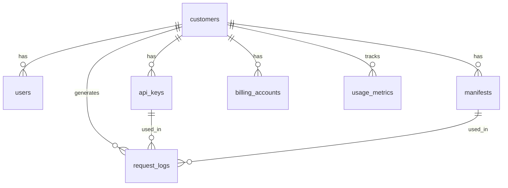

# Database Schema

CryptoLay uses PostgreSQL as its primary database. This document describes the complete database schema, including tables, relationships, and indexes.

## Overview

The database is designed to support:
- Customer management and authentication
- API key management
- Encryption manifests
- Request logging and audit trails
- Billing and usage tracking

## Core Tables

### customers

Stores customer account information.

```sql
CREATE TABLE customers (
    id UUID PRIMARY KEY DEFAULT gen_random_uuid(),
    name VARCHAR(255) NOT NULL,
    email VARCHAR(255) UNIQUE NOT NULL,
    status VARCHAR(50) DEFAULT 'active',
    tier VARCHAR(50) DEFAULT 'free',
    created_at TIMESTAMP DEFAULT CURRENT_TIMESTAMP,
    updated_at TIMESTAMP DEFAULT CURRENT_TIMESTAMP
);
```

| Column | Type | Description |
|--------|------|-------------|
| `id` | UUID | Primary key |
| `name` | VARCHAR(255) | Customer name |
| `email` | VARCHAR(255) | Unique email address |
| `status` | VARCHAR(50) | Account status (active, suspended, etc.) |
| `tier` | VARCHAR(50) | Subscription tier (free, pro, enterprise) |
| `created_at` | TIMESTAMP | Account creation timestamp |
| `updated_at` | TIMESTAMP | Last update timestamp |

### users

Stores user accounts within customer organizations.

```sql
CREATE TABLE users (
    id UUID PRIMARY KEY DEFAULT gen_random_uuid(),
    customer_id UUID REFERENCES customers(id) ON DELETE CASCADE,
    email VARCHAR(255) NOT NULL,
    password_hash VARCHAR(255) NOT NULL,
    role VARCHAR(50) DEFAULT 'user',
    status VARCHAR(50) DEFAULT 'active',
    created_at TIMESTAMP DEFAULT CURRENT_TIMESTAMP,
    updated_at TIMESTAMP DEFAULT CURRENT_TIMESTAMP,
    UNIQUE(customer_id, email)
);
```

| Column | Type | Description |
|--------|------|-------------|
| `id` | UUID | Primary key |
| `customer_id` | UUID | Foreign key to customers |
| `email` | VARCHAR(255) | User email address |
| `password_hash` | VARCHAR(255) | Bcrypt hashed password |
| `role` | VARCHAR(50) | User role (user, admin) |
| `status` | VARCHAR(50) | User status |
| `created_at` | TIMESTAMP | Account creation timestamp |
| `updated_at` | TIMESTAMP | Last update timestamp |

### api_keys

Stores API keys for authentication.

```sql
CREATE TABLE api_keys (
    id UUID PRIMARY KEY DEFAULT gen_random_uuid(),
    customer_id UUID REFERENCES customers(id) ON DELETE CASCADE,
    name VARCHAR(255) NOT NULL,
    key_hash VARCHAR(255) NOT NULL,
    permissions JSONB NOT NULL,
    expires_at TIMESTAMP,
    last_used TIMESTAMP,
    status VARCHAR(50) DEFAULT 'active',
    created_at TIMESTAMP DEFAULT CURRENT_TIMESTAMP,
    updated_at TIMESTAMP DEFAULT CURRENT_TIMESTAMP
);
```

| Column | Type | Description |
|--------|------|-------------|
| `id` | UUID | Primary key |
| `customer_id` | UUID | Foreign key to customers |
| `name` | VARCHAR(255) | API key name |
| `key_hash` | VARCHAR(255) | Hashed API key |
| `permissions` | JSONB | Array of permissions |
| `expires_at` | TIMESTAMP | Expiration timestamp |
| `last_used` | TIMESTAMP | Last usage timestamp |
| `status` | VARCHAR(50) | Key status (active, revoked) |
| `created_at` | TIMESTAMP | Creation timestamp |
| `updated_at` | TIMESTAMP | Last update timestamp |

### manifests

Stores encryption manifests that define field-level encryption rules.

```sql
CREATE TABLE manifests (
    id UUID PRIMARY KEY DEFAULT gen_random_uuid(),
    customer_id UUID REFERENCES customers(id) ON DELETE CASCADE,
    name VARCHAR(255) NOT NULL,
    description TEXT,
    fields JSONB NOT NULL,
    status VARCHAR(50) DEFAULT 'active',
    created_at TIMESTAMP DEFAULT CURRENT_TIMESTAMP,
    updated_at TIMESTAMP DEFAULT CURRENT_TIMESTAMP
);
```

| Column | Type | Description |
|--------|------|-------------|
| `id` | UUID | Primary key |
| `customer_id` | UUID | Foreign key to customers |
| `name` | VARCHAR(255) | Manifest name |
| `description` | TEXT | Manifest description |
| `fields` | JSONB | Array of field names to encrypt |
| `status` | VARCHAR(50) | Manifest status |
| `created_at` | TIMESTAMP | Creation timestamp |
| `updated_at` | TIMESTAMP | Last update timestamp |

### request_logs

Stores audit logs for all API requests.

```sql
CREATE TABLE request_logs (
    id UUID PRIMARY KEY DEFAULT gen_random_uuid(),
    customer_id UUID REFERENCES customers(id) ON DELETE CASCADE,
    api_key_id UUID REFERENCES api_keys(id),
    manifest_id UUID REFERENCES manifests(id),
    request_type VARCHAR(50) NOT NULL,
    endpoint VARCHAR(255) NOT NULL,
    request_data JSONB,
    response_data JSONB,
    status_code INTEGER,
    ip_address INET,
    user_agent TEXT,
    processing_time_ms INTEGER,
    created_at TIMESTAMP DEFAULT CURRENT_TIMESTAMP
);
```

| Column | Type | Description |
|--------|------|-------------|
| `id` | UUID | Primary key |
| `customer_id` | UUID | Foreign key to customers |
| `api_key_id` | UUID | Foreign key to api_keys |
| `manifest_id` | UUID | Foreign key to manifests |
| `request_type` | VARCHAR(50) | Request type (encrypt, decrypt, etc.) |
| `endpoint` | VARCHAR(255) | API endpoint |
| `request_data` | JSONB | Request payload |
| `response_data` | JSONB | Response data |
| `status_code` | INTEGER | HTTP status code |
| `ip_address` | INET | Client IP address |
| `user_agent` | TEXT | User agent string |
| `processing_time_ms` | INTEGER | Request processing time |
| `created_at` | TIMESTAMP | Request timestamp |

## Billing Tables

### billing_accounts

Stores billing account information.

```sql
CREATE TABLE billing_accounts (
    id UUID PRIMARY KEY DEFAULT gen_random_uuid(),
    customer_id UUID REFERENCES customers(id) ON DELETE CASCADE,
    stripe_customer_id VARCHAR(255),
    subscription_id VARCHAR(255),
    plan VARCHAR(50) DEFAULT 'free',
    status VARCHAR(50) DEFAULT 'active',
    created_at TIMESTAMP DEFAULT CURRENT_TIMESTAMP,
    updated_at TIMESTAMP DEFAULT CURRENT_TIMESTAMP
);
```

### usage_metrics

Stores usage metrics for billing.

```sql
CREATE TABLE usage_metrics (
    id UUID PRIMARY KEY DEFAULT gen_random_uuid(),
    customer_id UUID REFERENCES customers(id) ON DELETE CASCADE,
    metric_type VARCHAR(50) NOT NULL,
    value INTEGER NOT NULL,
    period_start DATE NOT NULL,
    period_end DATE NOT NULL,
    created_at TIMESTAMP DEFAULT CURRENT_TIMESTAMP
);
```

## Indexes

### Performance Indexes

```sql
-- API key lookups
CREATE INDEX idx_api_keys_key_hash ON api_keys(key_hash);
CREATE INDEX idx_api_keys_customer_id ON api_keys(customer_id);
CREATE INDEX idx_api_keys_status ON api_keys(status);

-- Request logs
CREATE INDEX idx_request_logs_customer_id ON request_logs(customer_id);
CREATE INDEX idx_request_logs_created_at ON request_logs(created_at);
CREATE INDEX idx_request_logs_request_type ON request_logs(request_type);

-- Manifests
CREATE INDEX idx_manifests_customer_id ON manifests(customer_id);
CREATE INDEX idx_manifests_status ON manifests(status);

-- Users
CREATE INDEX idx_users_customer_id ON users(customer_id);
CREATE INDEX idx_users_email ON users(email);
```

### Composite Indexes

```sql
-- Customer + status combinations
CREATE INDEX idx_api_keys_customer_status ON api_keys(customer_id, status);
CREATE INDEX idx_manifests_customer_status ON manifests(customer_id, status);

-- Request logs by customer and date
CREATE INDEX idx_request_logs_customer_date ON request_logs(customer_id, created_at);
```

## Foreign Key Relationships



## Data Retention

### Request Logs

- **Free Tier**: 30 days
- **Pro Tier**: 90 days
- **Enterprise**: 1 year

### API Keys

- Revoked keys are soft-deleted
- Expired keys are automatically deactivated
- Key history is retained for audit purposes

### Usage Metrics

- Daily metrics are aggregated monthly
- Monthly metrics are retained for 2 years
- Annual metrics are retained indefinitely

## Backup and Recovery

### Automated Backups

- Daily full backups
- Hourly incremental backups
- Point-in-time recovery available

### Backup Retention

- Daily backups: 7 days
- Weekly backups: 4 weeks
- Monthly backups: 12 months

## Security Considerations

### Encryption at Rest

- All sensitive data is encrypted at rest
- Database connections use TLS
- Backup files are encrypted

### Access Control

- Database access is restricted to application servers
- Connection pooling with authentication
- Audit logging for all database access

### Data Privacy

- Customer data is isolated by customer_id
- Soft deletes for compliance
- Data export capabilities for GDPR compliance 